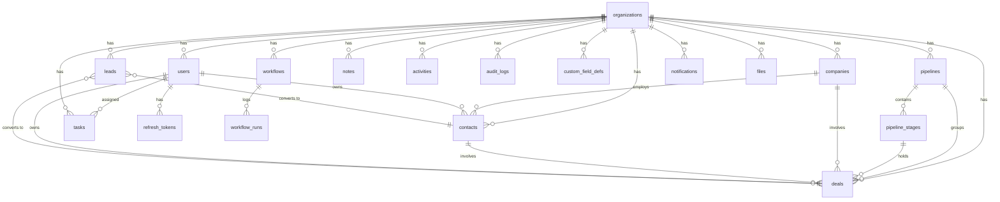

# Database Design

PostgreSQL 16. All tenant tables carry `org_id` and are composite-indexed on it. UUIDs (v4, generated in the app) for all primary keys — safe to expose in URLs, mergeable across environments. Timestamps are `timestamptz` in UTC. Soft state (won/lost, converted, deactivated) is modeled with status columns + timestamps rather than deletes; hard deletes cascade via FKs and are always audit-logged.

## ER diagram



Polymorphic links (`tasks`, `notes`, `activities`, `files` → any record) use `(related_type, related_id)` pairs — pragmatic for timeline-style access patterns; integrity is enforced in the service layer and by org-scoping.

## Tables

### Identity & tenancy
| Table | Purpose | Key columns |
|---|---|---|
| `organizations` | Tenant root | `id, name, created_at` |
| `users` | Org members | `org_id, email (unique), password_hash, name, role ∈ {admin,manager,member}, is_active` |
| `refresh_tokens` | Rotating refresh tokens | `user_id, token_hash (sha256), expires_at, revoked_at` |

### CRM core
| Table | Purpose | Key columns |
|---|---|---|
| `companies` | Accounts | `org_id, name, domain, industry, size, website, phone, address, owner_id, custom jsonb` |
| `contacts` | People | `org_id, first_name, last_name, email, phone, title, company_id, owner_id, custom jsonb` |
| `leads` | Unqualified prospects | `org_id, name, email, phone, company_name, source, status ∈ {new,contacted,qualified,unqualified,converted}, owner_id, custom jsonb, converted_contact_id, converted_deal_id` |
| `pipelines` | Sales processes | `org_id, name, is_default` |
| `pipeline_stages` | Ordered stages | `pipeline_id, name, position, probability, is_won, is_lost` |
| `deals` | Opportunities | `org_id, title, value numeric(14,2), currency, pipeline_id, stage_id, contact_id, company_id, owner_id, status ∈ {open,won,lost}, expected_close_date, closed_at, custom jsonb` |

### Work & collaboration
| Table | Purpose | Key columns |
|---|---|---|
| `tasks` | To-dos | `org_id, title, description, due_date, priority ∈ {low,medium,high}, status ∈ {open,done}, assignee_id, related_type, related_id, created_by, completed_at` |
| `notes` | Notes on records | `org_id, body, related_type, related_id, author_id` |
| `activities` | User-facing timeline | `org_id, type, actor_id, entity_type, entity_id, payload jsonb` |
| `notifications` | In-app inbox | `org_id, user_id, type, title, body, entity_type, entity_id, read_at` |
| `files` | Attachment metadata | `org_id, filename, mime, size, storage_key, related_type, related_id, uploaded_by` |

### Platform
| Table | Purpose | Key columns |
|---|---|---|
| `audit_logs` | Append-only compliance log | `org_id, actor_id, action, entity_type, entity_id, changes jsonb, created_at` |
| `custom_field_defs` | Custom field metadata | `org_id, entity_type, key, label, field_type ∈ {text,number,date,select,checkbox}, options jsonb, required, position` — values live in each record's `custom` JSONB |
| `workflows` | Automation recipes | `org_id, name, trigger_type, conditions jsonb, actions jsonb, is_active` |
| `workflow_runs` | Execution log | `workflow_id, org_id, event jsonb, status ∈ {success,partial,failed}, detail jsonb` |
| `schema_migrations` | Applied migrations | `version, applied_at` |

## Custom fields: JSONB over EAV

Definitions are rows in `custom_field_defs`; values are keys in the record's `custom` JSONB column. Compared to an EAV table this keeps reads single-row (no N-way joins to render a record), writes atomic, and export trivial, while `custom->>'key'` remains filterable and (if a field gets hot) expression-indexable: `CREATE INDEX ... ON contacts ((custom->>'region')) WHERE org_id = ...`. Validation against definitions happens in the service layer on write.

## Index strategy

Every tenant query pattern gets a composite index led by `org_id`:

```sql
-- examples (full list in the migration)
CREATE INDEX contacts_org_name    ON contacts (org_id, last_name, first_name);
CREATE INDEX contacts_org_email   ON contacts (org_id, email);
CREATE INDEX deals_org_stage      ON deals (org_id, stage_id) WHERE status = 'open';   -- kanban
CREATE INDEX deals_org_closed     ON deals (org_id, closed_at) WHERE status = 'won';   -- revenue report
CREATE INDEX tasks_org_assignee   ON tasks (org_id, assignee_id, status, due_date);    -- my tasks
CREATE INDEX activities_org_ent   ON activities (org_id, entity_type, entity_id, created_at DESC);
CREATE INDEX audit_org_created    ON audit_logs (org_id, created_at DESC);
CREATE INDEX notif_user_unread    ON notifications (user_id, created_at DESC) WHERE read_at IS NULL;
```

Global search uses `ILIKE` over indexed name/email columns at MVP scale; the documented upgrade is `pg_trgm` GIN indexes, then `tsvector` full-text — both additive migrations.

## Integrity & concurrency notes
- Lead conversion, registration (org+user+pipeline seed), and deal stage moves run in explicit transactions.
- `deals.value` is `numeric(14,2)` — never floats for money. Currency is per-deal ISO-4217 (org default applied by the UI).
- FKs use `ON DELETE` rules chosen per relation: org cascade wipes a tenant; `owner_id`/`assignee_id` use `SET NULL` so departing users never destroy records.
- The audit log is written in the same transaction as its mutation — a change without its audit row is impossible.

## Migrations

Plain SQL files in `apps/api/src/db/migrations/`, applied in filename order by the built-in migrator (`npm run migrate`), tracked in `schema_migrations`, each file wrapped in a transaction. Rules: migrations are append-only (never edit an applied file), backward-compatible where possible (expand → migrate → contract), and run automatically on container start (safe: advisory-locked so N replicas don't race).
