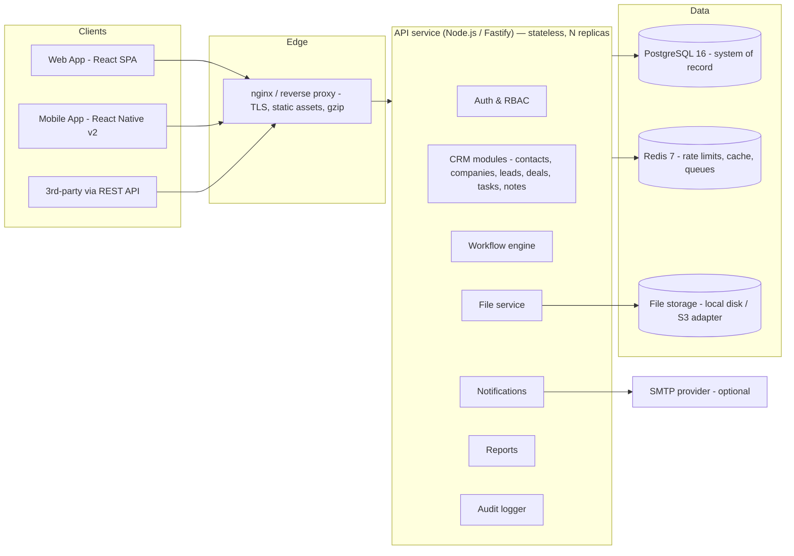
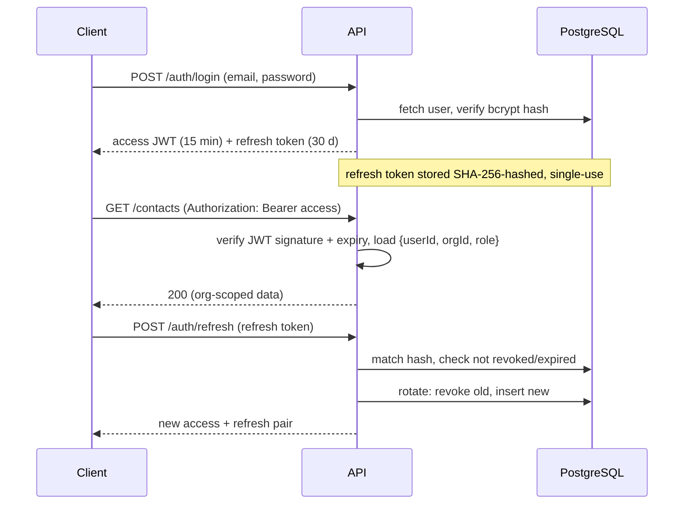
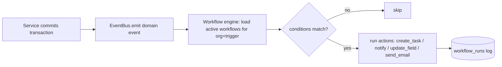
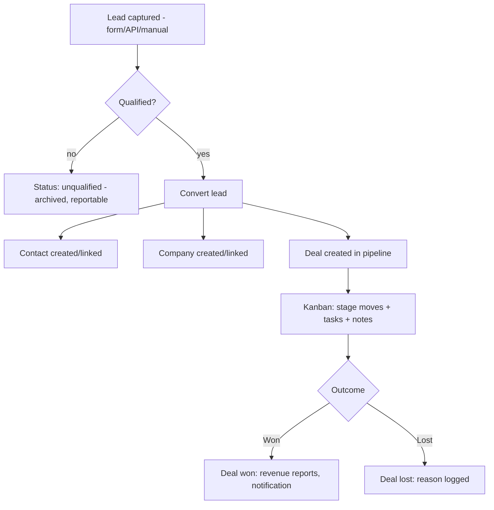
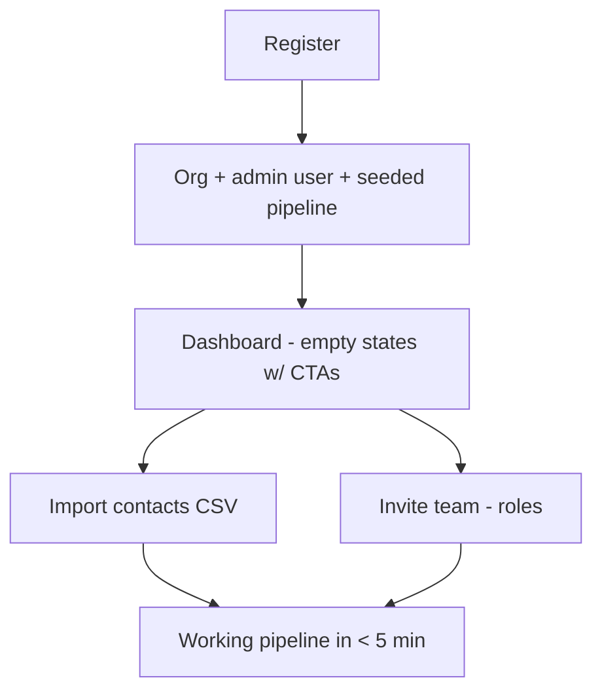

# System Architecture

## 1. Overview

NimbusCRM is a **modular monolith**: one stateless API service with strictly separated feature modules, one PostgreSQL database, optional Redis, and a static single-page web app. This maximizes operational simplicity (one container to run, one DB to back up) while keeping clean seams for future extraction (email-sync worker, automation worker) if scale demands.



### Request path & layering

Every module follows the same three layers; nothing skips a layer:

```
routes.ts        HTTP concerns: parse/validate (zod), authn/authz guards, status codes
   ↓
service.ts       business rules: transactions, cross-module calls, events, audit entries
   ↓
repo.ts          SQL only: parameterized queries, always org-scoped (org_id in every WHERE)
```

Cross-cutting concerns are Fastify plugins: auth (JWT verify → `request.user`), error handling (typed AppError → HTTP), rate limiting, security headers, request logging with request IDs.

## 2. Multi-tenancy

**Model:** shared database, shared schema, `org_id` discriminator column on every tenant table (the model used by HubSpot and most SaaS at comparable scale).

Enforcement is defense-in-depth:
1. `org_id` is never read from request bodies — always from the authenticated JWT.
2. Every repository method requires `orgId` as its first parameter; every query filters on it; composite indexes lead with `org_id`.
3. Integration tests create two orgs and assert cross-tenant reads/writes fail (404, not 403 — no existence leaks).
4. Future hardening path (documented, not enabled): PostgreSQL Row-Level Security with `SET app.current_org`, making isolation a DB guarantee.

Why not schema-per-tenant or DB-per-tenant? Operationally heavy (migrations × N tenants), kills cross-tenant ops (metrics, upgrades), and unnecessary below ~10⁴ tenants. The `org_id` model scales to millions of rows per table with the right indexes, which the schema ships with.

## 3. Authentication & authorization



- **RBAC:** three roles (admin / manager / member) checked in route guards (`requireRole`) and re-checked in services for sensitive operations (user management, settings, deletes of others' records). The permission matrix lives in `docs/03-security/security.md`.
- Passwords: bcrypt cost 12. Account deactivation revokes all refresh tokens.

## 4. Workflow automation engine

Recipe model: **trigger → conditions → actions**, stored as JSONB, executed in-process off a typed event bus that services emit domain events onto (`lead.created`, `deal.stage_changed`, `deal.won`, `task.completed`, …).



Design points:
- Events are emitted **after** the triggering transaction commits (no phantom triggers on rollback).
- Action execution is at-least-once, isolated per workflow (one failing action logs and continues; it never breaks the user's request).
- `update_field` actions re-emit no events in v1 (no cascade loops by construction); a depth counter guards future relaxation.
- The engine is behind an interface; the documented scale-up path is moving execution onto a Redis-backed queue (BullMQ) with zero schema changes — `workflow_runs` already records state.

## 5. Notifications

In-app notifications are rows (`notifications` table) surfaced by polling `GET /notifications` (30 s interval in the web app — simple, proxy-friendly). Email delivery is an adapter: `Mailer` interface with SMTP (nodemailer) and no-op/dev implementations; SMS follows the same adapter pattern in v2 (Twilio). Upgrade path to SSE/WebSocket documented; the table design doesn't change.

## 6. Files

`FileStorage` interface with a local-disk implementation (uploads dir, content-addressed keys, size/MIME limits). S3-compatible implementation is a drop-in v2 adapter (same interface; presigned URLs). Metadata (name, size, MIME, linked record) lives in Postgres; bytes never do.

## 7. Audit & activity

Two distinct streams, both append-only:
- **`activities`** — user-facing timeline ("Daniel moved ACME deal to Proposal"), rendered on records and dashboards.
- **`audit_logs`** — compliance stream: every mutation with actor, entity, and field-level before/after diff. Admin-only, filterable, exportable. Written inside the service layer (same transaction as the mutation) so the log can't miss a change.

## 8. Reporting & analytics

v1 reports are SQL aggregates over the live database (fast at MVP scale with the shipped indexes; the heaviest — revenue by month — is a single index scan). Documented scale path: nightly rollup tables → read replica → external warehouse (ClickHouse) at 10⁷+ rows, none of which changes the API surface.

## 9. Performance & scalability

- Stateless API → horizontal scale behind the proxy; connection pooling via `pg.Pool` (documented PgBouncer step at high replica counts).
- Pagination is mandatory on all list endpoints (max 100); every list query is backed by a composite index starting with `org_id`.
- Rate limiting per IP (unauthenticated) and per user (authenticated), Redis-backed when available.
- Web app: code-split routes, TanStack Query caching, optimistic updates on kanban moves.
- Kubernetes-ready: health (`/healthz`) and readiness (`/readyz` = DB ping) endpoints, graceful shutdown (SIGTERM drains), config via env, no local state except the uploads volume (S3 adapter removes even that).

## 10. Backup & disaster recovery (summary — full runbook in docs/04-operations)

- Nightly `pg_dump` (custom format) to versioned, off-host storage; optional WAL archiving for PITR (RPO ≈ 5 min).
- Uploads dir rsync/S3 sync on the same schedule.
- Quarterly restore drill scripted in the runbook; RTO target 1 h on a fresh host via Compose.

## 11. Key user flows




